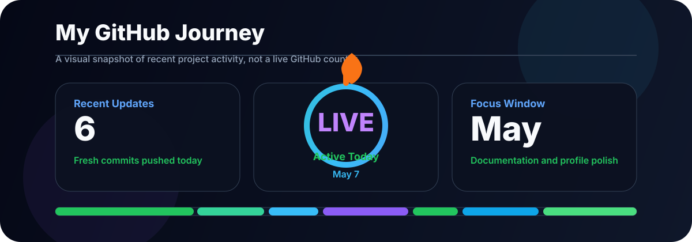
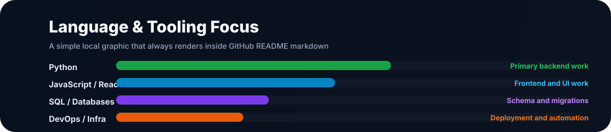

<p align="center">
  
</p>

---

<div align="center">

### ✨ Computer Science Engineer | Full-Stack Builder | ML Enthusiast

**Crafting software that matters** — from intuitive frontends to robust backends, across systems and AI.

[](https://github.com/TIRTHANATH20)
[](https://www.linkedin.com/in/tirtha-nath)
[](mailto:tirthanath2006@gmail.com)
[](https://github.com/TIRTHANATH20?tab=repositories)

</div>

---

## 🎯 About

I'm a Computer Science Engineer passionate about building **practical, well-crafted systems**. My work spans:

- **Software**: Full-stack applications, APIs, microservices
- **Machine Learning**: Computer vision, data processing, model optimization
- **Hardware Design**: Physical design flows, RTL synthesis, VLSI

I believe in **clean code**, **strong documentation**, and **shipping work worth keeping**.

---

## 🚀 What I'm Working On

> **Current Focus:** Shipping polished contributions across active projects | Building cleaner user experiences | Releasing open-source work with strong documentation

- Practical systems that solve real problems
- Consistent commits and meaningful contributions
- High-quality projects others can learn from and build upon

---

## 💻 Tech Stack

```
Languages:  Python  Java  C  C++  JavaScript/React  TypeScript
Frameworks: Flask  FastAPI  React  Tailwind  Express
Databases:  MySQL  PostgreSQL  SQLite  MongoDB
Tools:      Git  Docker  Linux  Nginx  CI/CD
Hardware:   OpenLane  OpenROAD  Verilog  GDSII
```

---

## 🏆 Featured Projects

| Project                                                                    | Description                                                                                  |
| -------------------------------------------------------------------------- | -------------------------------------------------------------------------------------------- |
| **[SecureGigGuardian](https://github.com/TIRTHANATH20/SecureGigGuardian)** | Security platform for gig workers — fraud detection, contract verification, real-time alerts |
| **[Agent Marketplace](https://github.com/TIRTHANATH20/Agent-Marketplace)** | Full-stack app for discovering and purchasing AI agents with JWT authentication              |
| **[RouteXpert](https://github.com/TIRTHANATH20/RouteXpert)**               | Smart routing engine using live traffic data for optimal path selection                      |
| **[AI Image Colorization](https://github.com/TIRTHANATH20)**               | Computer vision project restoring grayscale images into vibrant color                        |
| **[SPM in OpenLane](https://github.com/TIRTHANATH20)**                     | Physical design flow from Verilog to GDSII using industry tools                              |

---

## 📊 My GitHub Journey

<p align="center">
  
</p>

<p align="center">
  
</p>

---

## 🎨 My Approach

- **Quality over Quantity**: Meaningful commits, not noise
- **Clear Documentation**: Readmes, comments, and guides that actually help
- **Consistent Improvement**: Regular updates and refinements across projects
- **User-Focused Design**: Features and interfaces that just work

---

## 🔗 Let's Connect

| Platform     | Link                                                                          |
| ------------ | ----------------------------------------------------------------------------- |
| **GitHub**   | [@TIRTHANATH20](https://github.com/TIRTHANATH20) — See my latest work         |
| **LinkedIn** | [tirtha-nath](https://www.linkedin.com/in/tirtha-nath) — Professional updates |
| **Email**    | [tirthanath2006@gmail.com](mailto:tirthanath2006@gmail.com) — Direct message  |

---

<p align="center">
  
</p>

<p align="center">
  <sub>Built with ☕ and a passion for clean code</sub>
</p>
